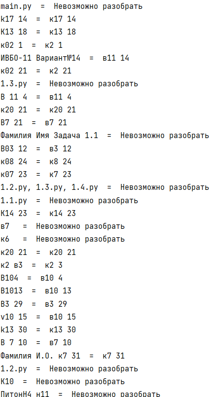
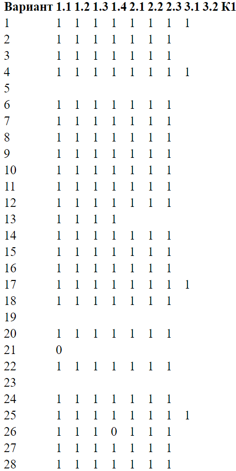

# 2 доп практика
## _Иванцова Михаила_

## Папки с заданиями

- part1 - папка с заданиями 1 части 
- banner - Разработать функцию, выдающую ASCII-баннер с пользовательским текстом. См. сайт figlet.org. Для вывода текста использовать шрифт standard.
- graph - Написать утилиту командной строки, формирующую дерево каталогов и файлов с учетом вложенности и начиная с заданного пути. Результат должен быть выдан в виде текста в формате graphviz.
- razbor - Реализуйте функцию parse_subj(text) для разбора темы сообщения, поступающего к почтовому роботу kispython. Ниже показаны примеры (в количестве 41) присланных тем, которые робот не сумел разобрать.
- kispythonToHTML - Реализовать утилиту командной строки для преобразования данных с сайта с результатами проверки робота kispython в форматы csv, ascii и html. Использовать данные вашей группы из table.json.