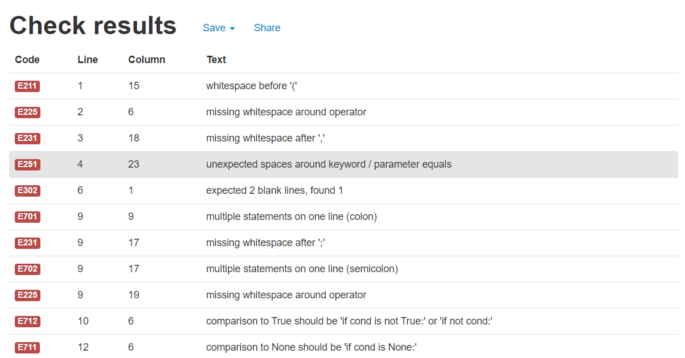
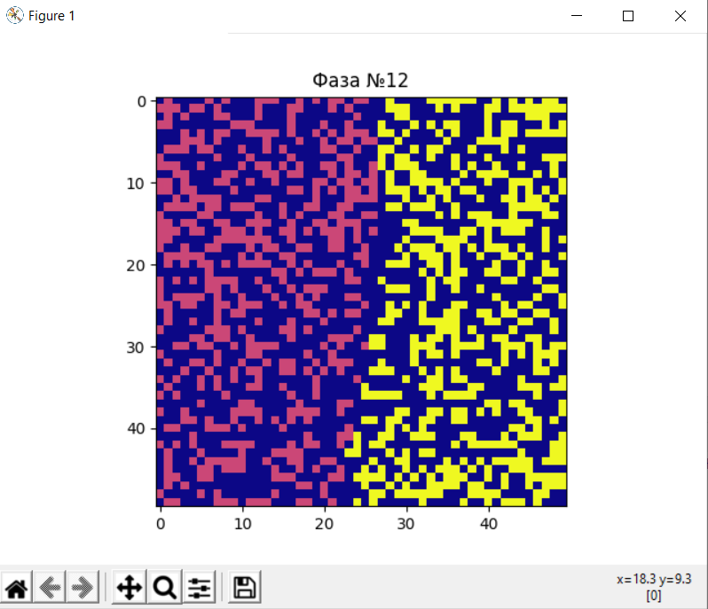
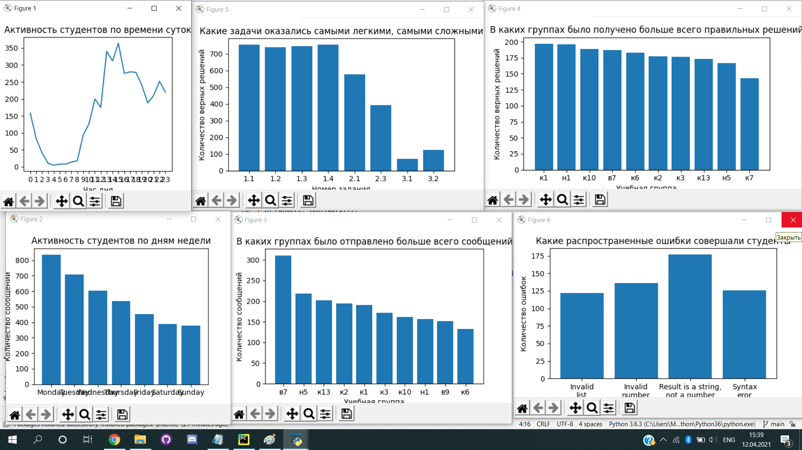

# 3 доп практика
## _Иванцова Михаила_

## Папки с заданиями

- pep8 - Привести примеры кода, которые соответствуют следующим нарушениям PEP 8(1 часть)
- part12 - Реализовать модель сегрегации Шеллинга в MatplotlibРеализовать модель сегрегации Шеллинга в Matplotlib
- part21 - Проанализировать данные, полученные от почтового робота. С помощью графиков ответить на следующие вопросы
