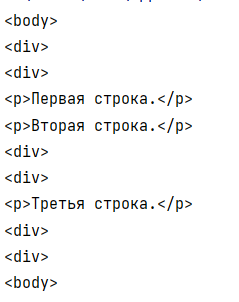
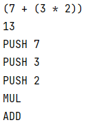
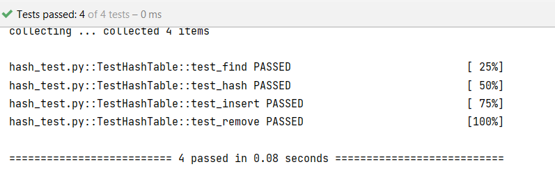

# 4 доп практика
## _Иванцова Михаила_

## Папки с заданиями

- html - Язык HTML-тегов с помощью менеджера контекста
- tree - Работа с деревьями выражений

Реализовать классы Num, Add, Mul.
Реализовать класс-посетитель PrintVisitor для печати выражения. Обойтись без операторов ветвления.
Реализовать класс-посетитель CalcVisitor для вычисления выражения. Обойтись без операторов ветвления.
Реализовать класс-посетитель StackVisitor для порождения кода стековой машины по выражению. Обойтись без операторов ветвления.

- own_hash - Реализуйте свою структуру данных, хэш-таблицу, аналог встроенного dict. Используйте функцию hash. 